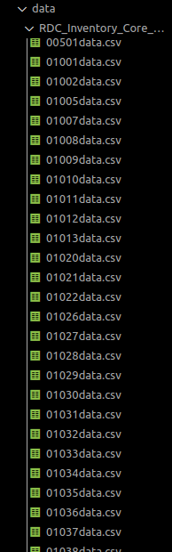

# Housing Market Predictor

The goal of this project is to predict the future housing market costs based on certain factors.

## 1.2.2

The current status on this project is ongoing.

#### Introduction

> NOTE: This project is made for personal and education purposes. All data used is sourced from https://www.realtor.com.

###### What is it?

This project will utilize certain Machine Learning Models to train on a given dataset, which will then be used to predict future housing prices of that given zip code.

###### Why do we care?

We may want to learn the price of an average house on a certain zip code and be able to get an estimate on what that price may be, whether it is 6 months from now, or even 20 years.

###### How does it work?

This project's inspiration sources from the data given from [Realtor](https://www.realtor.com). 
DataReader.py will turn the data into smaller datasets based on the zip code. This data will not be available on github as it is 500+ MB of data. 
From there, we can run multiple Machine Learning models on our data to get any type of data that we are searching for.

> Currently, we are running Linear Regression on the given datasets, however this is set to change in the future as I progress further on the project.

#### The vision

I have always been semi-interested in real estate, and what interested me the most was the housing market, and how location, world situations, and the economy affected it. Becuase of this, I went to search for data that I could use to possibly predict the future of the housing market. At first, I found a lot of information, but I never got some of the answers I was truly looking for. Because of this, I decided to search for the raw data and do it myself.
After searching for a while, I had stumbled across the dataset given by Realtor.com. This contained 2.5+ million lines of data of market data for all of the United States.
I had always been interested in Machine Learning, but I never understood what I was doing, so I did not have an idea of what to do going into this. So, it sounded like a fun project so that I can learn and enjoy something I found interesting.

While this dataset does not contain everything I am looking for, I believe it is a good start to not only doing basic predictions, but also a good base for future development.

#### Understanding 

> Current 1.2.2
In order to understand what is happening, there are a few concepts that we first must know.
1. Linear Regression
	- Linear Regression is a model that will create a linear line that will most closely fit the dataset. There is then a score that is produced that will give the distance from the line to each data point on its respective independent variable. 
	- To learn more about Linear Regression, I highly suggest viewing this [statistichowto](https://www.statisticshowto.com/probability-and-statistics/statistics-definitions/what-is-a-regression-equation/) page and these [CU Boulder slides](https://www.colorado.edu/amath/sites/default/files/attached-files/ch12_0.pdf).
2. Statistics
	- All we have to know is what would consitute as a good use of Linear Regression when it pertains to this dataset. For instance, if our Linear Regression model were to give back a score of .843(which is calculated using 1-(u/v) where u is the [Residual Sum of Squares or RSS](https://en.wikipedia.org/wiki/Residual_sum_of_squares), and v is the [Total Sum of Squares or TSS](https://en.wikipedia.org/wiki/Total_sum_of_squares)), We can say that the model did a good job of fitting the dataset.
	- To expand on the last point, if we were to get a low number such as .44 or a negative number, we could determine that the model may not be the best fit or should not even be used at all when it pertains to the dataset given.
3. Variables that affect housing
	- While we will not be using most of these factors in our current model, there are many factors that affect housing market prices.
	- We will first be predicting the housing market based on location, date, and historical data to help predict future values.

#### Putting it together and what I did

- Because the dataset provided by Realtor had a lot of data that was all put into 1 CSV file, I made a more personal file call DataReader.py, which takes a given CSV, cleans it up by removing or reformatting columns into how I want it to look like, and also splits the CSV into multiple CSVs based on a given key that is passed in.

>  

- From there, we are able to start working with our data that has been split. Because the data is not provided in github, I will leave an example CSV in the src file.

> [src file containing example CSV](https://github.com/Kevin-Vigil/HousingMarketPredictor/tree/main/data-finding/src)

From here, I will giving a brief explaination of what I did to represent my data and apply Linear Regression to it. To see it in full, view the [Jupyter Notebook](https://github.com/Kevin-Vigil/HousingMarketPredictor/blob/main/data-finding/src/PricePredictor.ipynb) here. The given explaination will be based off the example csv given in the src file.

- 

#### The future
